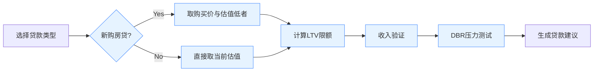

# 抵押贷款计算器需求文档

## 一、产品目标
为迪拜地区购房者/业主提供精准的贷款额度预测工具，支持多种贷款类型计算（新购/转贷/套现）

## 二、核心功能需求

### 1. 输入参数模块
- 房产信息（估值/购买价）
- 收入构成（固定工资/自营收入/租金收入）
- 现有负债（车贷/个人贷/信用卡）
- 贷款类型选择（新购/转贷/套现/组合）

### 2. 计算逻辑引擎
#### LTV规则矩阵：
| 用户类型       | 首套≤500万 | 首套>500万 | 二套 | 期房 |
|----------------|------------|------------|------|------|
| 阿联酋本地居民 | 85%        | 75%        | 65%  | 50%  |
| 外籍人士       | 80%        | 70%        | 60%  | 50%  |

#### DBR压力测试模型：
`DBR = (月负债总额 + 拟贷月供) / 月总收入 ≤ 50%`
- 租金收入按年租金10/12折算
- 利率压力测试（基准利率+2%）

### 3. 输出展示模块
- 最大可贷金额（考虑LTV上限）
- 最长贷款期限（年龄≤65/70岁）
- 压力测试月供金额
- 相关费用估算（评估费+登记费+转让费等）

## 三、业务规则


## 四、特殊场景处理
1. **组合贷款**（转贷+套现）：
   - 需同时验证原贷款余额和新贷LTV
   - 示例流程：
   ```
   原贷款：AED 136万 → 新估值200万
   转贷部分：136万（LTV=68%）
   套现部分：40万 → 总LTV=(136+40)/200=88% → 触发风控预警
   ```

2. **自雇人士验证**：
   - 需导入2年审计财报
   - 营收计算规则：
   ```
   可认收入 = 净利润 × 资本占比 + 董事薪酬
   ```

## 五、非功能性需求
- 计算响应时间＜1秒
- 支持英阿双语切换
- 移动端适配
- 数据加密存储（符合UAECB规范）
