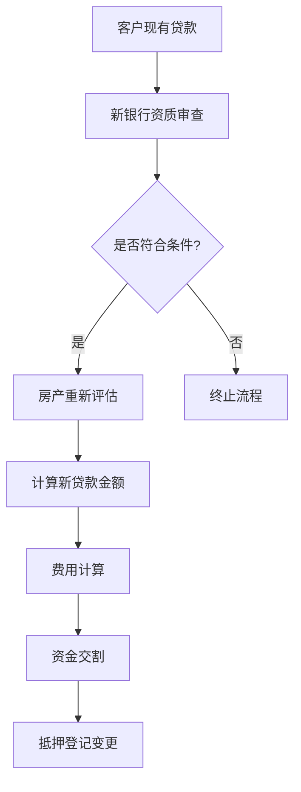
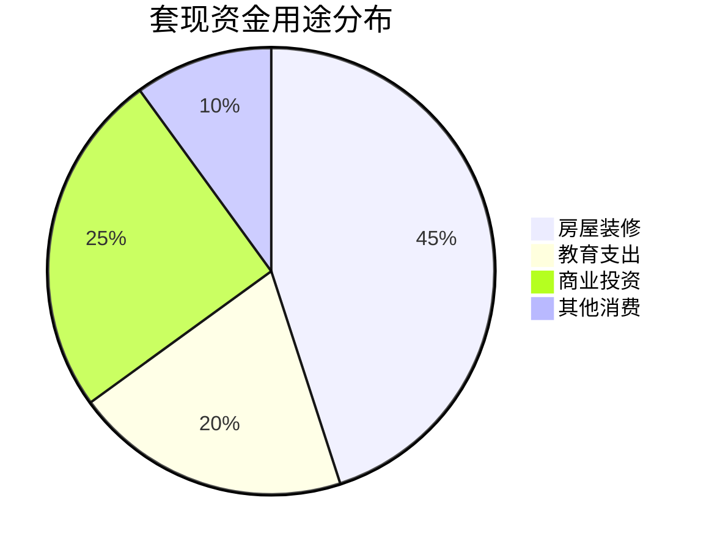

# 抵押贷款转贷计算全流程指南

## 1. 转贷核心逻辑流程图


## 2. 基础计算公式

### 2.1 新贷款金额确定
`公式`：  
新贷款额 = Min(现有贷款余额 + 套现金额, 评估价值 × 适用LTV)

```javascript
// 计算示例：
现有贷款余额 = 1,360,000 AED
评估价值 = 2,000,000 AED
LTV上限 = 70%
最大可贷额 = 2,000,000 × 0.70 = 1,400,000 AED
可套现金额 = 1,400,000 - 1,360,000 = 40,000 AED
```

### 2.2 债务负担率验证
`公式`：  
DBR = (新贷款月供 + 其他负债) / 月收入 ≤ 50%

```javascript
// 压力测试案例：
新贷款额 = 1,400,000 AED
贷款期限 = 20年
压力利率 = 5.5%
月供 = 9,641 AED
其他负债 = 2,500 AED
月收入 = 35,000 AED

DBR = (9,641 + 2,500) / 35,000 = 34.69% → 符合要求
```

## 3. 费用计算矩阵

| 费用类型                | 计算标准                          | 封顶金额    |
|-------------------------|-----------------------------------|-------------|
| 房产评估费              | 固定2,500-3,000 AED              | -           |
| 抵押登记费              | 新贷款额×0.25% + 290 AED         | -           |
| 银行手续费              | 新贷款额×1%                      | 10,000 AED  |
| 原银行提前还款费        | 未偿本金×1%                      | 10,000 AED  |
| DLD抵押解除费           | 1,300-1,600 AED                  | -           |

```javascript
// 费用计算示例：
新贷款额 = 1,400,000 AED
评估费 = 2,800 AED
抵押登记费 = (1,400,000×0.0025)+290 = 3,790 AED
银行手续费 = Min(1,400,000×0.01,10,000) = 10,000 AED
提前还款费 = Min(1,360,000×0.01,10,000) = 10,000 AED
总费用 = 2,800 + 3,790 + 10,000 + 10,000 = 26,590 AED
```

## 4. 转贷效益分析模型

### 4.1 利率对比分析表
| 参数               | 原贷款           | 新贷款           |
|--------------------|------------------|------------------|
| 贷款余额           | 1,360,000 AED    | 1,400,000 AED    |
| 剩余期限           | 18年            | 20年            |
| 利率               | 5.8%            | 4.5%            |
| 月供               | 10,327 AED       | 9,058 AED        |
| 总利息支出         | 967,032 AED      | 774,  920 AED   |

```javascript
// 净现值计算：
月供差额 = 10,327 - 9,058 = 1,269 AED/月
总节省 = 1,269 × 240 = 304,560 AED
净收益 = 304,560 - 26,590 = 277,970 AED
```

## 5. 转贷加套现特别条款

### 5.1 套现资金使用限制


### 5.2 套现额度验证公式
`最大套现额 = (评估价值 × LTV) - 现有贷款余额`

```javascript
// 验证案例：
评估价值 = 3,500,000 AED
LTV上限 = 70%
现有贷款 = 2,000,000 AED
可套现额 = (3,500,000×0.70) - 2,000,000 = 450,000 AED
```

## 6. 风险控制要点

1. **LTV动态监控**  
   每季度自动比对EMAAR房价指数，当评估值下降5%时触发重新评估

2. **利率重置机制**  
   浮动利率贷款每36个月按最新EIBOR+margin重置

3. **提前还款限制期**  
   前36个月内提前还款需支付剩余本金1%的罚金

4. **保险强制条款**  
   必须购买贷款余额110%的人身意外险
